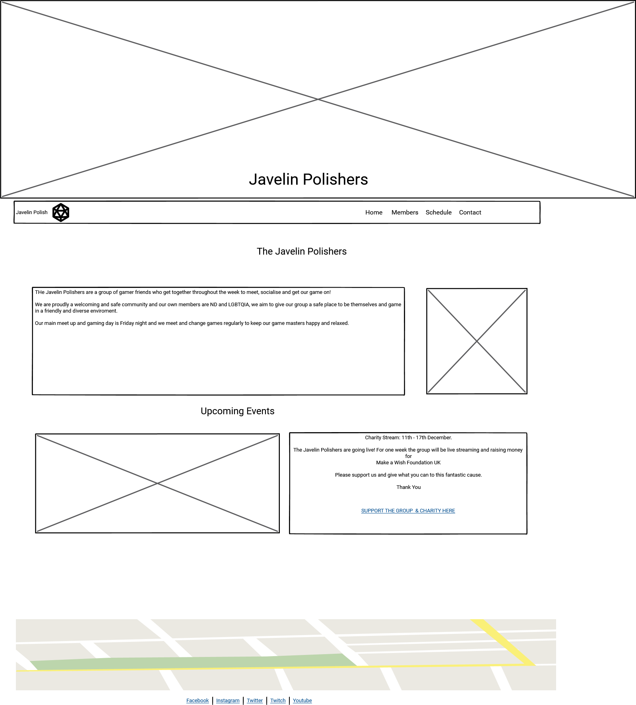
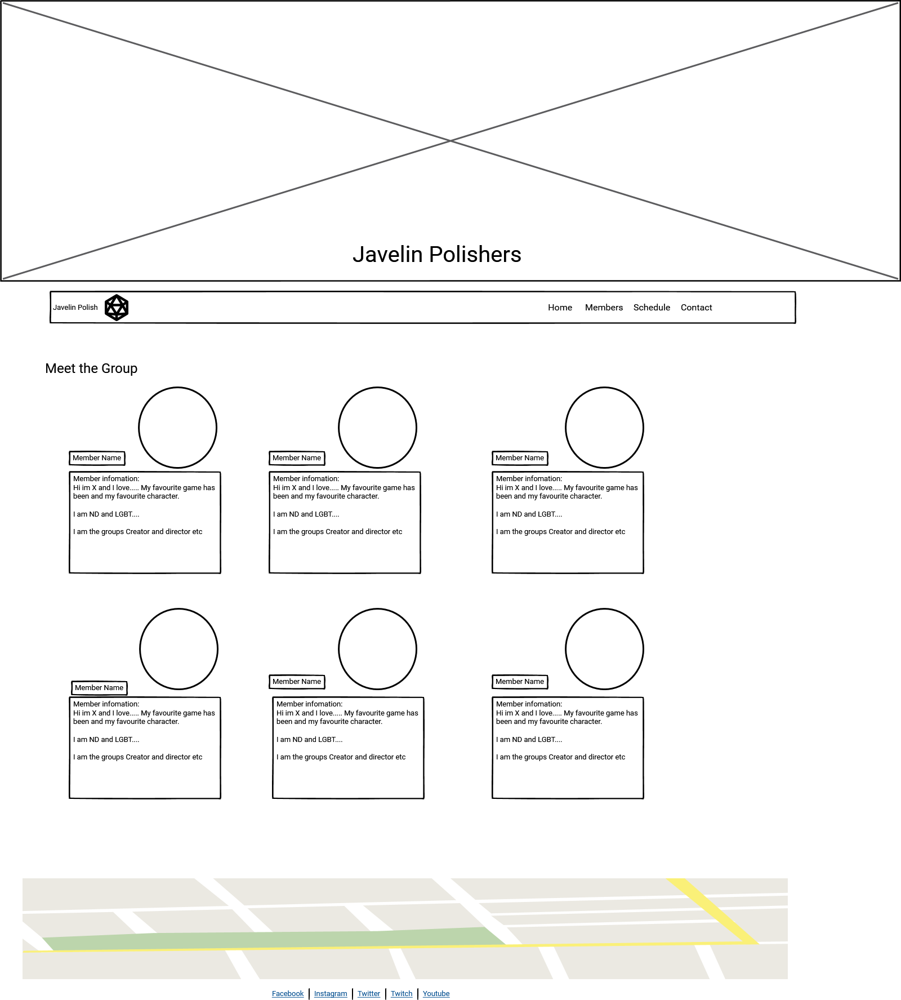
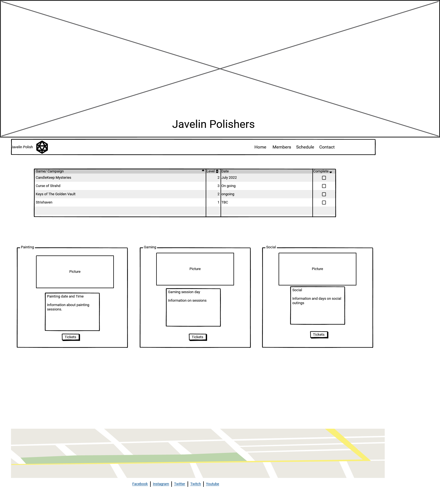
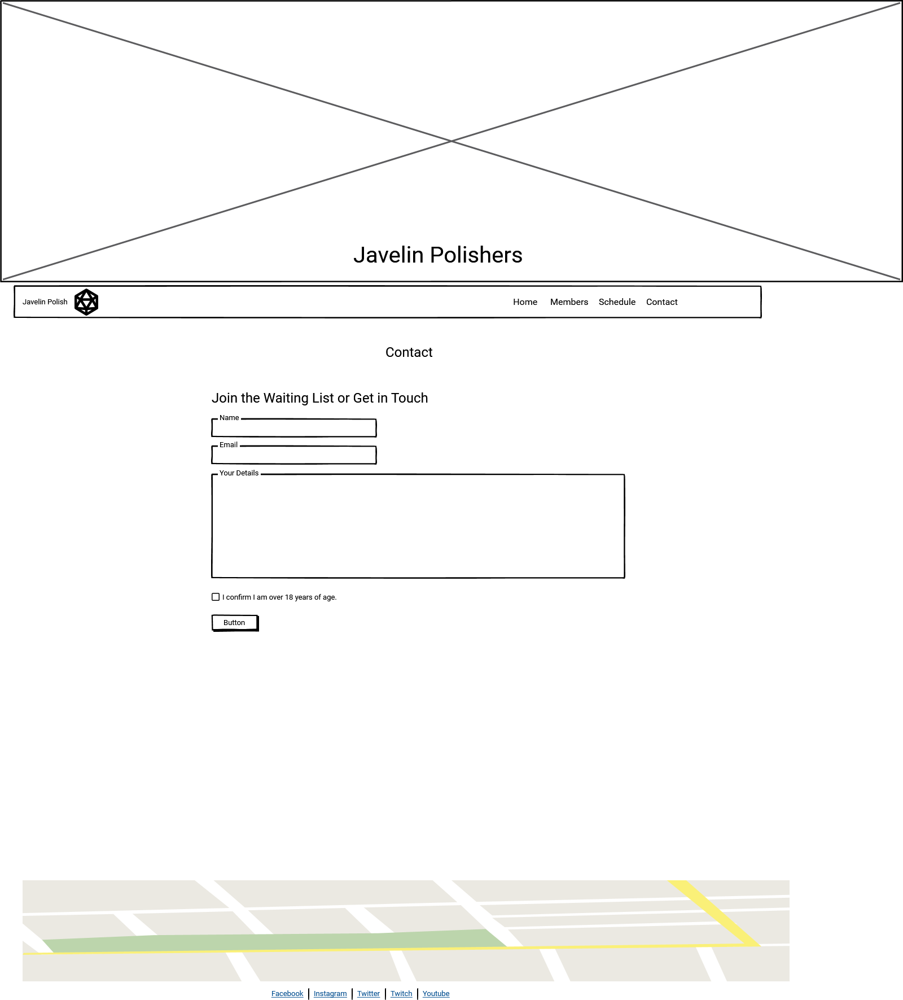

# Javelin Polisher's Gaming Club Website

Created by Clarice Boldon

The live site link is:[JAvelin Polishers Live Website:] (<https://clariceboldon.github.io/Milestone1-JavelinPolishers/>)

This is the main website of my local gaming group.

### Javelin Polishers Gaming Club

This is the readme file and documentation to go alongside this project. The project is to build a website for my local gaming club. The project is being built using HTML5, CSS and bootstrap as my first milestone project. This is part of Code Institute's Diploma in Web Application.

## Contents

1. Project Planning & User Experience.

   - Purpose of Project User Experience (UX)
   - Client Goals
   - About my Client
   - User Goals (First Visit, Returning and Frequent users)
   - The Five Planes

2. Design layout & Structure.

   - Wireframe
   - Structure
   - Colour Palette
   - Typography
   - Imagery

3. Wireframe

4. Structure

5. Colour Palette

6. Technologies Used.

   - Languages
   - Frameworks, Libraries and Programs used
     Bootstrap: v5.3.1
     Favicon.io

   - Future Ideas (Blog, booking form, price list)

7. Testing.

   - Wc3
   - Peer Review
   - Bugs
   - Accessibility

8. Deployment.

9. Credits.

## Project Planning & User Experience (UX)

With the principles of design I have followed the five planes of stratergy, Scope, Structure & Surface. My aim is to make my website as responsive, clear, accessible and eye catching.

### Purpose of the Website

The purpose of the website is to showcase what the gaming group have been doing and what they have planned this will include a shedule and upcoming events. The website will also allow others to learn a little about the group and join a waiting list. There will also be a small section to book tickets to events.

### About the group

The group consist of six friends from in and around the local area of Neath Port Talbot. The group play table top roleplaying games and met through a love of Dungeons and Dragons.

### User Goals

- To view who the group are
- To view infomation about whats on
- To check for updates including live streams
- To contact the group to join the waiting list or to ask a question.
- To book a place into a session

### Group Goals

- To have a easy to follow shedule
- To have a professional looking website
- To develop a online presence and give people a chance to see whats happening
- To gain potential players on a waiting list.

### First Time Visitor

- A first time visitor will want to quickly find a way to contact the group, they can do this via the contact me page.
- They will likely want to see what games are being played or what the future shedules look like.
- They may use it to find social media pages
- The may use it to join the waiting list to join games.
- The may use it to find out who is in the group and if its an inclusive space.
- They may use it to book a space on an event.

### Returning Visitors

- A returning visitor would likely want to view an ongoing shedule and future games.
- They may have forgotten contact infomation or social links so are coming back to get in touch or follow the group.
- They could also just be looking for updates on waiting list and future events.
- They may want to join the waiting list
- Or book into a session

### Frequent Visitors

- Will likely be there to find out what is happening on the shedule.
- They will use the site to view updated and new or events.
- They will also likely go to the waiting list to see if any spots have opened.

## The Five Planes

#### Strategy

Questions I have condidered during my research include:
Who is likely to use this site: Target Audience? Target audience is people interested in learning or playing Table Top Role playing games (TTRPG) in the local area.

Is the content relevant? I will need to make sure that the site looks professional for any interested party to view and use the site effectiantly but by having clear and infomative pages.

Group Goals: The Group would love to become and offical group and a safe and inclusive space for Neurodivergant adults, Minorities and LGBTQIA+ people. They also hope to grow and apply for grants to grow in the future.

#### Scope

Needs: The website needs to have a contact infomation page that has a clear join the waiting list option.So that visitors can get in touch or request to join.
It should also have infomation about who we are, what we do to make the group clear and accessible to people. It also needs to have a easy to view and read schedule so visitors can see what is going on and when.

Must Have Pages: Home, Shedule and Contact.
If I have enough time I willa also include a members page, as socila story to help others see how the group is!

Potential options for later: Blog, Streaming options and application form for download.

#### Structure

The website needs to be clear and simple structure, with easy to follow straight forward links. It needs to be consistant and meet conventions of structure to allow ease of use and user consistency.

#### Skeleton

Navigation: Visual iconography to help navigation. Simple Navigation bar

Interface: Needs to be visually appealing and clear. Meets the needs of users!

Features: The features I use must be useful, and follow the same pattern. Infomation needs to be put in priority order. With minimal features and complexity to add to usebility and a better user experience.

#### Surface

The visual look of the website is very important. As many of the group is Neurodivergant I want to make sure the fonts, colours, images and order of the website is as clean and appealing as possible. One issue ND people have is with certain fonts and colours, so I will use basic colours and fonts. With minimal blocks of text to make it easier to read.

## Design Layout & Structure

### Wireframes

#### Sitemap

#### Index Page

#### Members Page

#### Schedule

#### Contact

### Structure

Every page will contain the d20 header image, an alert to an application form for new members (to be put on a waiting list). I will also have a footer and location map on each page.

- Home
  A simple home page, with a brief history and a nice image to greet the user.
  I will also add a basic news article onto this page which will be about our upcoming live stream.

- Members
  A basic section detailing our group members and a small sentace each with an image displayed for everyone.

- Schedule
  I will include a small table with a list of games we are currently playing and the levels.

- Contact
  A simple form to fill in to contact us.

### Colour Palette

I used bootstraps built in colors to bring my website to life. However I did use some flashes of colour throughout the site.

### Typography

As a woman with ASD I wanted to make the website as accessible for others as possible. One thing myself and other ND people can struggle with is typography and content. I will research what will work better for a more visual appealing and friendly website.

Another thing I noticed that large walls of texts we're incredibly off putting and most people just don't bother to read them. So I tried to keep everything as basic and concise as I was able. 

- Font type:
  Part of my research was to find out which fonts where best for accessability and the following came up: Tahoma, Calibri, Helvetica, Arial, Verdana & Times New Roman.
  Slab Serif fonts including Arvo, Museo Slab and Rockwell were accessible but for headings rather than body text.

### Imagery

- Hero Image: Photo by Timothy Dykes on Unsplash
- Game play Image:Photo by Robert Coelho on Unsplash
- Handrawrn map image: Photo by >Patrick Fobian on unsplash
- Paint brushes: By Ravi KAnt on Pexels

I used some pictures the group had taken themselves for the member section. It was quickly apparent how much better professional images will look. But this wasnt possible for this project. I would try to make sure in future, professional images were available.  I also used some royalty free images to bolster the pages and make everything pop out.

## Technologies used

### Languages

- Html 5
- CSS

### Frameworks, Libraries and Programmes

- Bootstrap - At the time of writing this readme I was using the latest version of bootstrap which was v5.3.
- Fontawesome.com: Was used for Icons across the site.
- Favicon.io: Allowed me to add a custom D20 Dice to the wesbite.

### Websites

- For my form I used <https://startbootstrap.com/> to get a rough guide on how I wanted the form to look. I then customised it to my own need adding and changing most of the original. 

### Future Ideas

The webpage could be used into the future to stream live games. A blog could also be added as well as writing content and tables for other table top players.
We could also have a more detailed calender and schedule, with a more thourough booking system rather than ticketsource.

## Testing

### WC3

### Peer Review

### Bugs

- Bug 1: When I deployed my site, I found most of my images where not loading. I had added the images as absolute filepaths. But then changed them to relative files paths.
  Is my site accessable (siteimprove.com)

- Bug 2: My make a wish image was not responsive on Galaxy fold screens.To recitify this I needed to remove the class paddings and my CSS sizing options which stopped it from working correctly.

- Bug 3: Favicon was not loading. Issue was the imags were not linked correctly to the root directory.

- Bug 4: Contactform not functioning properly. I needed to change my code and add required to all the input options.  

### Accessability

Part of building this website was to factor in how to make the site more accessabile to everyone. Big blocks of long text, different fonts and size can all have an impact on how easy the site is to navigate. I used a service called Siteimprove.com to help me work out what was working and what wasnt for accessability.

## Deployment

To deploy my site I used Github Pages. Below are the steps you need to deploy them are:

1. Navigate to the Github repository:[Github Repository](https://github.com/ClariceBoldon/Milestone1-JavelinPolishers)
2. Navigate to the settings tab.
3. On the left hand menu, select pages.
4. From the Source menu select Branch main
5. From branch select main.
6. Live link will be shown when published correctly.

The live site link is:[JAvelin Polishers Live Website:] (<https://clariceboldon.github.io/Milestone1-JavelinPolishers/>)

## Credits

Firstly I'd love to give a big shout out and thank you to my fellow students, particularly my cohort who have been a great support and help over the weeks.

I would like to thank my mentor for being approachable, helpful and on the ball!

I would like to thank my cohort facilitator for keeping my interest and helping the team grow, those weekly planners made a world of difference in the first few weeks!

A big thanks to Code Institute staff for all their help

I couldnt have found out half the infomation I needed without slack and the community of students, mentors, staff and alumni and my peers who helped me get keep going!
