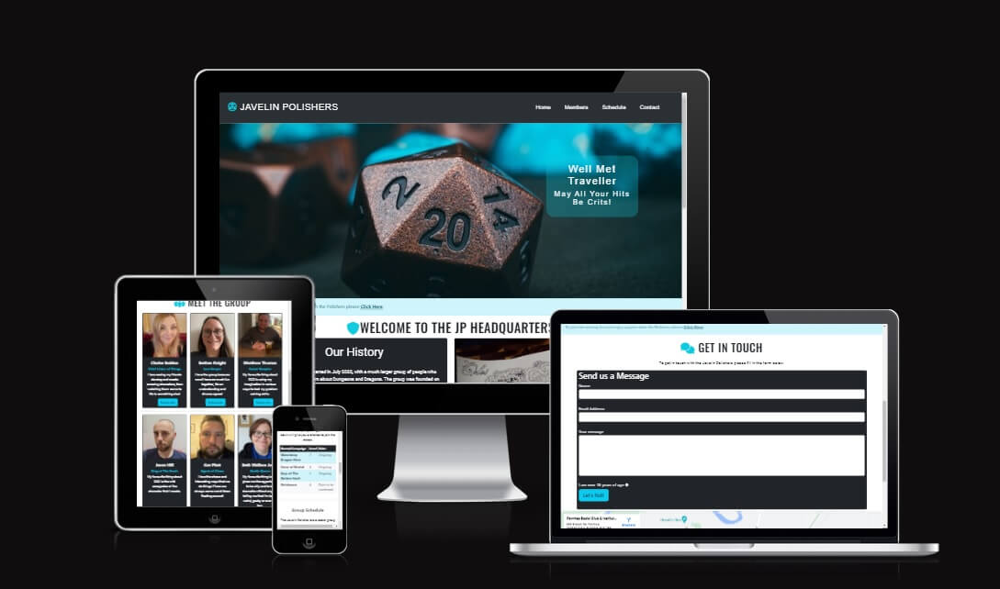
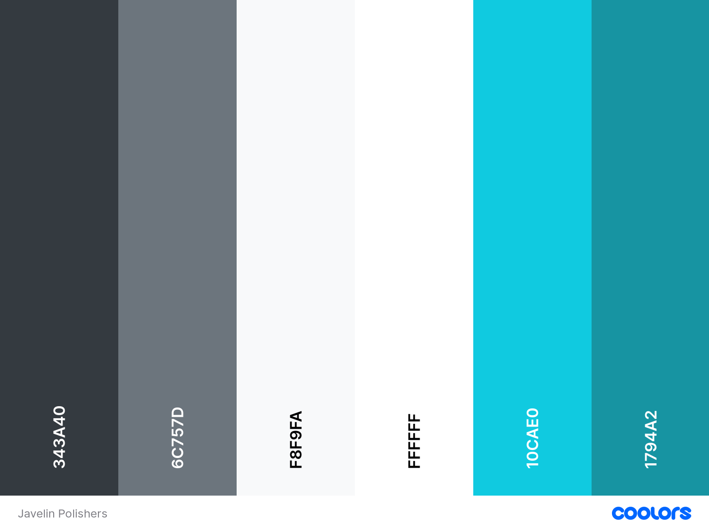
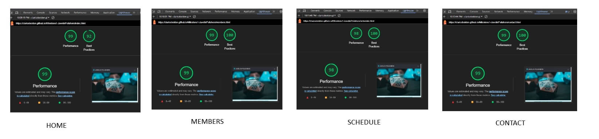
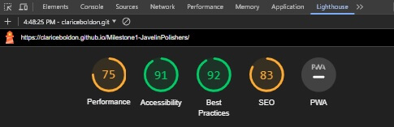

# **Javelin Polisher's Gaming Club Website**

Created by Clarice Boldon

The live site link is: [Javelin Polishers Live Website](https://clariceboldon.github.io/Milestone1-JavelinPolishers/)

This is the main website of my local gaming group.

### **Javelin Polishers Gaming Club**

This is the readme file and documentation to go alongside this project. The project is to build a website for my local gaming club. The project is being built using HTML5, CSS, and Bootstrap as my first milestone project. This is part of Code Institute's Diploma in Web Application.

## **Contents**

1. **Project Planning & User Experience.**

   - Purpose of Project User Experience (UX)
   - Client Goals
   - About my Client
   - User Goals (First Visit, Returning and Frequent users)
   - The Five Planes

1. **Design Layout & Structure.**

   - Wireframe
   - Structure
   - Colour Palette
   - Typography
   - Imagery

1. **Wireframe**

1. **Structure**

1. **Colour Palette**

1. **Technologies Used.**

   - Languages
   - Frameworks, Libraries, and Programs used
   - Future Ideas (Blog, booking form, price list)

1. **Testing.**

   - Wc3
   - Peer Review
   - Bugs
   - Accessibility

1. **Deployment.**

1. **Credits**

## **Project Planning & User Experience (UX)**

With the principles of design, I have followed the five planes of strategy, Scope, Structure, and surface. My aim is to make my website responsive, clear, accessible, and eye-catching.

### **Purpose of the Website**

The purpose of the website is to showcase what the gaming group has been doing and what they have planned this will include a schedule and upcoming events. The website will also allow others to learn a little about the group and join a waiting list. There will also be a small section to book tickets to events.

### **About the group**

The group consists of six friends from in and around the local area of Neath Port Talbot. The group plays tabletop roleplaying games and meets through a love of Dungeons and Dragons. The group meets several times a month and wants to start organizing more days.

### **User Goals**

Due to the nature of the website, many of the user goals were mostly the same across the board whether the user was brand new or a frequent visitor. So I have written a little detail about each of them with a description of why and how they are met. But included links to the pictures in the first section, to not repeat the same thing.

- To view who the group is
- To view information about what is on
- To check for updates including live streams
- To contact the group
- To join a waiting list
- To book a place on to a session
- To follow the group on social media

#### **Meeting User Goals**

##### **Who are the group?**

1. **Who are the group members?**
   I included a members page, to allow visitors to view the members of the group. I wanted to create a quick and basic social story to help neurodivergent users have a chance to visually see and get a little understanding of the group. I also included member titles and a short bio to bring each member's personality out a little.
   [A screenshot of the members section. It shows six profile pictures of three women and three men.](assets/images/documentation/meet-group-rm.jpg)

1. **What is on?**

I included a schedule page to help users easily find what games or campaigns were running. There is a small table that includes what games and levels are currently being played. There is also some information and booking options on the page with current events.
[A screenshot showing a table of games and a row of images for booking](assets/images/documentation/schedule-screenshot.jpg)

1. **Check for updates**

Because the group wasn't particularly active yet with streaming, I included a future streaming event on the home page. This was also accompanied by information on how to support them when they run a charity stream in December. I included a dummy link to GoFundMe as this is what the group is most likely to use.
[A screenshot showing information on a Make a Wish charity fundraising event](assets/images/documentation/events.jpg)

1. **Contact the Group**

A Form was added to a contact page to make it easy for users to send a message or ask a question.
[A screenshot of the contact form](assets/images/documentation/contact-form.jpg)

1. **To join a waiting list**

I included an alert just under my hero image for a survey to join a waiting list for a space with the gaming group.
[A screenshot of the alert and survey link](assets/images/documentation/alert.jpg)

1. **Get social**

   Help users find out more about members or to follow the group's social media platforms. I added social media links and follow-me buttons for individual members.
   [A screenshot of the Footer with social media links](assets/images/documentation/footer.jpg)
   [A screenshot of the follow me buttons on the member cards.](assets/images/documentation/follow-me.jpg)

### **Group Goals**

- To have an easy-to-follow chart of what's being played.
- To have a professional-looking website
- To develop an online presence and give people a chance to see what's happening
- To gain potential players on a waiting list.

#### Meeting Group Goals

1. **Chart**

   To meet the group's goals I added a clear table on the schedule that gave a simple but concise look at the current campaigns being played and character levels.

1. **Professional Website**

To meet the needs of the group I tried to keep the color palette and look as clean as possible. The information provided was limited so I tried to make sure there was enough to cover the pages and offer enough detail.

1. **Online Presence**

   A simple goal was to just get them online with a website, that they could show to friends, family, or interested parties.

1. **Waiting List**

The group wasn't sure how they wanted to implement a waiting list system but came up with a few questions. I was able to add a Survey Monkey link with a range of questions which was then directed back to the group email.

### **First Time Visitor**

- A first-time visitor will want to quickly find a way to contact the group, they can do this via the Contact Me page.
- They will likely want to see what games are being played or what the future schedules look like.
- They may use it to find social media pages
- They may use it to join the waiting list to join games.
- They may use it to find out who is in the group and if it's an inclusive space.
- They may use it to book a space for an event.

1. **Contact the Group**

A simple easy way for first-time visitors to contact the group was through a straightforward form on the Contact Me page.

1. **What being played?**

I included a simple table to show what games were being played and at what level, this can be found on the schedule page.

1. **Social Media**

A potential first-time visitor would likely want to find out more and see if the group had a social media presence. I included a follow me button on all members and social media links in the footer. It should be noted that not all players at the time of creating the website had public social media profiles or the group as a whole so dummy links were added.

1. **Waiting List**

   As with the user goals a waiting list was quite likely to be the most important feature on the website so I added a Survey Link.

1. **Who is who?**

Much like the user needs first-time visitors would most likely want to see who was in the group. Because our group is heavily neurodivergent they wanted to add a little friendly tagline to each member. The hope would be contacting the group would be less intimidating.

1. **Event Booking**

   A list of events and tickets to Ticketsource were added to the what's on/schedule page

### **Returning Visitors**

- A returning visitor would likely want to view an ongoing schedule and future games.
- They may have forgotten contact information or social links so are coming back to get in touch or follow the group.
- They could also just be looking for updates on a waiting list and future events.
- They may want to join the waiting list

Returning visitors would likely want the same things as other visitors, they may have forgotten or need reminding of something. So would likely need to contact, book, or check what games are on or what days events are or the times. Screenshots are found in the above links.

### **Frequent Visitors**

- Will likely be there to find out what is happening on the schedule.
- They will use the site to view updates and new events.
- They will also likely go to the waiting list to see if any spots have opened.

  Like other visitors the goals are much the same, however, frequent visitors are likely to book events or check for news.

## **The Five Planes**

#### **Strategy**

Questions I have considered during my research include:
Who is likely to use this site: Target Audience? The target audience is people interested in learning or playing Table Top Role-playing games (TTRPG) in the local area.

Is the content relevant? I will need to make sure that the site looks professional for any interested party to view and use the site efficiently by having clear and informative pages.

Group Goals: The Group would love to become an official group and a safe and inclusive space for Neurodivergent adults, Minorities, and LGBTQIA+ people. They also hope to grow and apply for grants to grow in the future.

#### **Scope**

Needs: The website needs to have a contact information page that has a clear join the waiting list option. So that visitors can get in touch or request to join.
It should also have information about who we are, and what we do to make the group clear and accessible to people. It also needs to have an easy-to-view and read schedule, so visitors can see what is going on and when.

Must-Have Pages: Home, Schedule, and Contact.
If I have enough time I will also include a members page, as a social story to help others see how the group is!

Potential options for later: Blog, Streaming options, and application form for download.

#### **Structure**

The website needs to be a clear and simple structure, with easy-to-follow straightforward links. It needs to be consistent and meet conventions of structure to allow ease of use and user consistency.

#### **Skeleton**

Navigation: Visual iconography to help navigation. Simple Navigation bar

Interface: Needs to be visually appealing and clear. Meets the needs of users!

Features: The features I use must be useful, and follow the same pattern. Information needs to be put in priority order. With minimal features and complexity to add to usability and a better user experience.

#### **Surface**

The visual look of the website is very important. As many of the group is Neurodivergant I want to make sure the fonts, colors, images, and order of the website are as clean and appealing as possible. One issue ND people have is with certain fonts and colors, so I will use basic colors and fonts. With minimal blocks of text to make it easier to read.

## **Design Layout & Structure**

### **Wireframes**

#### **Sitemap**

[Here is the wireframe for my sitemap](assets/images/documentation/sitemap.png "Sitemap")

#### **Index Page**

[This is the index page wireframe](assets/images/documentation/home-wireframe.jpg "Home Page")

#### **Members Page**

[This is the wireframe for my member's page](assets/images/documentation/member-wireframe.png "Members")

#### **Schedule**

[Here is the wireframe for my schedule page](assets/images/documentation/schedule-wireframe.png "Schedule")

#### **Contact**

[This is the wireframe for my contact page](assets/images/documentation/contact-wireframe.png "Contact")

### **Structure**

Every page will contain the d20 header image and an alert to an application form for new members (to be put on a waiting list). I will also have a footer and location map on each page. I will include four pages: Home, Members, Schedule, and Contact.

- **Header**
  For my header, I added a bootstrap navigation bar with a custom icon. I used font awesome to add the D20, a twenty-sided dice in one of my chosen colors. After my header tags, I then added a large hero image of another d20 with a set of dice in the background. I chose this image as it looked clean and fitted with the general aesthetic of the website. Underneath the hero image I added an alert, the alert gives users the option to sign up for the waiting list.
  I used Survey Monkey to create a basic application form. This would give people a chance to tell us about themselves and request to join.

- **Home**
  A simple home page, with a brief history and a nice image to greet the user.
  The home page needs to be clear, and concise with a need to know only information base.
  I also added a basic news article onto this page which will be about our upcoming live stream and a link to support the group. At the time of creating this webpage, the group wasn't ready for GoFundMe, so a link to GoFundMe was added instead.

- **Members**
  A basic section detailing the group members and a small sentence each with an image displayed for everyone. I added this as more of a social story, to allow potential Neurodivergent people the option of seeing who was in the group and following them to learn more. Only two of the members 'Matthew & Clarice' had a public gaming page so I linked them all to Instagram until such times as they had ready social media platforms to follow.

- **Schedule**
  I have included a small table with a list of games we are currently playing and the levels. I also added some more information but added a further what's on section, giving the option to procure tickets to events. These were not quite ready to go so dummy links to ticketsource were added.

- **Contact**
  I have included a simple bootstrap form to help visitors get in contact with the group. I have added a form dump to Code Institute for my form for this project.
  [A screenshot of the form success](assets/images/documentation/form-success.jpg "Form Dump Success")

- **Footer**
  For my footer, I added the location map for quick ease in finding the group. I also added social media links these were all dummy links only going to the websites themselves. The group had yet to set up the social media sites but was looking at doing so in the near future.
  The social media links I used were:
  - Facebook
  - Twitter
  - Twitch
  - Instagram
    I also added a copyright section, with a link to my GitHub account.

### **Colour Palette**

I used Bootstrap's built-in colors to bring my website to life. However, I did use some flashes of color throughout the site. This included icons.

### **Typography**

As a woman with ASD, I wanted to make the website as accessible for others as possible. One thing I and other ND people can struggle with is typography and content. I researched what would work better for a more visually appealing and friendly website.

Another thing I noticed is that large walls of texts are incredibly off-putting and most people just don't bother to read them. So I tried to keep everything as basic and concise as I was able.

- Font type:
  Part of my research was to find out which fonts were best for accessibility and the following came up: Tahoma, Calibri, Helvetica, Arial, Verdana & Times New Roman.
  Slab Serif fonts including Arvo, Museo Slab, and Rockwell were accessible but for headings rather than body text.

### **Imagery**

- Hero Image: Photo by Timothy Dykes on Unsplash
- Gameplay Image: Photo by Robert Coelho on Unsplash
- Handrawrn map image: Photo by Patrick Fobian on Unsplash
- Paint brushes: By Ravi Kant on Pexels

I used some pictures the group had taken themselves for the member section. It was quickly apparent how much better professional images would look. But this wasn't possible for this project. I will try to make sure in the future, professional images are available. I also used some royalty-free images to bolster the pages and make everything pop out.

## **Technologies used**

### **Languages**

- Html 5
- CSS3

### **Frameworks, Libraries, and Programmes**

- Bootstrap - At the time of writing this readme I was using the latest version of Bootstrap which was v5.3.
- Fontawesome.com: Was used for Icons across the site.
- Favicon.io: Allowed me to add a custom D20 Dice to the wesbite.
- Googlefont was used to import Roboto and Arvo.
- Git -Git was used to control versions of the website. I used the Gitpod terminal to commit to Git and Push to GitHub.
- GitHub: GitHub is used to store project code after it was pushed.
- Balsamiq: was used to design and create my wireframes.

### **Websites**

- Coolers: I developed my color palette using coolers.
- Survey Monkey: I used Survey Monkey to set up an application form to join the waiting list.
- Tinypng.com: I used this to compress my image files down so they didn't slow down the pages.
- imageresizer.com: I used this to resize my files.

### **Future Ideas**

The webpage could be used in the future to stream live games. A blog could also be added as well as writing content and tables for other tabletop players.
We could also have a more detailed calendar and schedule, with a more thorough booking system rather than TicketSource.

## **Manual Testing**

### **Dev Tools**

### **W3C**

I tested my site using W3C and these were my final results.
My results from W3C:

[Index Page Pass screenshot](assets/images/documentation/index-pass.jpg)

Here is the tested page finished with direct code input, the only issue was Codeanywhere now using trailing slash that the validator picked up on but is now acceptable syntax.

[Members Page Pass](assets/images/documentation/member-pass.jpg)

Here is the finished page, done with direct input.

[Schedule Page Pass](assets/images/documentation/schedule-pass.jpg)

This is the pass page done via direct input

[Contact Page Pass](assets/images/documentation/contact-pass.jpg)

My CSS results: [CSS Pass](assets/images/documentation/css-pass.png)

### **Peer Review**

My peer review was added to Slack. One of the main issues that came up was that my Survey form was able to be submitted without any input so I added mandatory questions to the form.

Some other suggestions were made regarding style but with the impending deadline, I decided to focus on my readme.

### **Family & Friends Testing**

I also asked family, friends, and members of the gaming group to go over and look at the site and give honest feedback. One issue was that it was far too much information. So I removed a few sentences from the History section on the index page and then shortened the Members page information and the bios. It cleared up the site and made a vast difference to those who were neurodivergent.

### **Accessibility**

#### **Is my site Accessible?**

I wanted to make sure there was a strong contrast between elements and background colors, so I utilized Bootstrap to draw out boxes and information.
I added Alternative text to images to ensure that visually impaired users could understand what the image was.

Part of building this website was to factor in how to make the site more accessible to everyone. Big blocks of long text, different fonts, and off-putting colors can all have an impact on how easy the site is to navigate.

I got some Neurodivergant friends to review the site and they found that a few of the boxes were overwhelming with text. I then narrowed the content down much further and included just a few sentences on the member's page as they found it far more readable and enjoyable.

I tested my sight for accessibility using Lighthouse here are the results.

#### **Home Page**

[91 Accessibility Score](assets/images/documentation/access-home.jpg)
I received a total score of 91.

#### **Members Page Accessibility**

[91 Accessibility Score](assets/images/documentation/access-member.jpg)
I gained a 91 score on the members page also.

#### **Schedule Page**

[92 Accessibility Score](assets/images/documentation/access-schedule.jpg)
For the schedule page, I received a 92 mark.

#### **Contact Page**

[92 Accessibility Score](assets/images/documentation/access-contact.jpg)
For the last page, I got a 92 score.

### **Chrome Developer Tools**

#### **Responsiveness**

##### **Devices Used:**

I utilized the built-in developer tools on Chrome to test the screens at all different sizes and on various devices. I then took screenshots of the most popular options, for a good range of viewability.

I used the following devices to test:

- iPhone SE
- Desktop Windows PC
- Samsung Galaxy s8+
- Ipad Air
- Samsung Glazy A51

##### **Iphone SE**

[Screenshot of iPhone SE Tests](assets/images/documentation/iphone-se-results.jpg)
Results: I had a good experience with the iPhone SE.

##### **iPhone 12 Pro**

[Screenshot of iPhone 12 Pro Tests](assets/images/documentation/iphone-12-pro.jpg)
I found the results on the iPhone 12 to be very satisfactory.

##### **Samsung Galaxy S8+**

[Screenshot of Samsung Galaxy S8+](assets/images/documentation/samsun-galaxy-s8.jpg)

##### **Ipad Air**

[Screenshot of Ipad air](assets/images/documentation/ipad-air.jpg)

##### **Samsung A51**

[Screenshot of Ipad air](assets/images/documentation/samsung-a51.jpg)

With these results, I was able to see padding needed to be added to my contact form. However, I acouldn't get the form to sit on all devices without the final version that you see. I liked the style of it and decided to keep it.

#### **Browser Compatability**

Chrome: Chrome performed very well and as the platform I normally use I was I had no issues.

Microsoft Edge: Performed well and with no issues.

### **Bugs**

##### **Testing Bugs**

Here were the issues the W3C pulled, and the corrections needed.

[Home Page Errors](assets/images/documentation/index-errors.jpg).

Index Page Error report: The error report came back with two errors on my 'make-a-wish' image. I added the width and height as an inline styling. So needed to adjust and add it to the CSS instead.

[Members Page Errors](assets/images/documentation/members-errors.jpg)
I had three errors: One was a simple stray div which was removed. The other was my hr element which had inline styling I added the CSS. I also need to change a section element to a div in my social media links.

[Schedule Page Errors](assets/images/documentation/schedule-errors.jpg)
I only had one error on this page and it was a simple stray div tag end which was easily removed.

There were no errors on my contact page.

##### **Further Bugs**

When going through my website I found the following bugs.

- Bug 1: When I deployed my site, I found most of my images were not loading. I added the images as absolute file paths. But then changed them to relative file paths.
- Bug 2: My 'make-a-wish' image was not responsive on Galaxy fold screens. To rectify this I needed to remove the class paddings and my CSS sizing options which stopped it from working correctly.
- Bug 3: Favicon was not loading. The issue was the images were not linked correctly to the root directory.

#### **Lighthouse**

**Desktop Results:**

Here are the Results of my desktop lighthouse results.

**Mobile Results:**

I had some issues with my mobile score, I have a slow home connection which I feel didn't help but had some issues such as:

- Eliminate render-blocking resources and reduce unused CSS: I felt this was out of the scope of my project and couldn't at the time do much about it. As it wanted me to remove Bootstrap CDN code I didn't feel this was achievable.
- Serve static assets with an efficient cache policy: I felt this was too out of the scope of the first project so couldn't do anything about it.
- The last fault was for an image element. I could not define the width or height to the lighthouses specifications without it not working on Apple devices. So chose to let this one sit.

#### **Manual Test of Features**

Navigation: Fully working with no issues.

Alert: Links on each page work without issue, and opens into a new tab.

Social Media Links: All navigation links are working and into new tabs

GoFundMe link: Working with a new tab and going to GoFundMe.

Created by Link: The link opens to Github without issue and on a new tab.

Member Follow Me links: All Follow Me links are working correctly and open a new window.

Tickets: working and linking to TicketSource in a new window.

Contact Form: All forms need filling and the validation works.

Survey: Survey Monkey is working and I have received two responses.

## **Deployment**

To deploy my site I used GitHub Pages. Below are the steps you need to deploy them:

1. Navigate to the GitHub repository:[Github Repository](https://github.com/ClariceBoldon/Milestone1-JavelinPolishers)
1. Navigate to the settings tab.
1. On the left-hand menu, select pages.
1. From the Source menu select Branch main
1. From branch select main.
1. A live link will be shown when published correctly.

The live site link is:[Javelin Polishers Live Website:](https://clariceboldon.github.io/Milestone1-JavelinPolishers/)

### **Local Deployment**

How to fork the repository for local deployment:

- Log in to GitHub.
- Locate the repository you wish to fork
- Locate the Fork button on the right-hand side and click.

### **Cloning**

How to Clone this Repository

- Log in to GitHub
- Locate the repository of the project you want to clone
- Locate the code button and click on your selection this is either HTTPS, Github CLI, or SSH.
- Copy the link shown
- In your chosen code editing terminal change the working directory to the location of the cloned directory.
- Type 'git clone' into the terminal followed by the link of the clone. Then hit enter.

## **Credits**

Firstly I'd love to give a big shout out and thank you to my fellow students, particularly my cohort who have been a great support and help over the weeks.

I would like to thank my mentor for being approachable, helpful, and on the ball! He took the time to listen and speak to me with understanding and kindness that really made all the difference.

I would like to thank my cohort facilitator for keeping my interest and helping the team grow, those weekly planners made a world of difference in the first few weeks!

A big thanks to the Code Institute staff for all their help

I couldn't have found out half the information I needed without Slack and the community of students, mentors, staff alumni, and my peers who helped me keep going!
